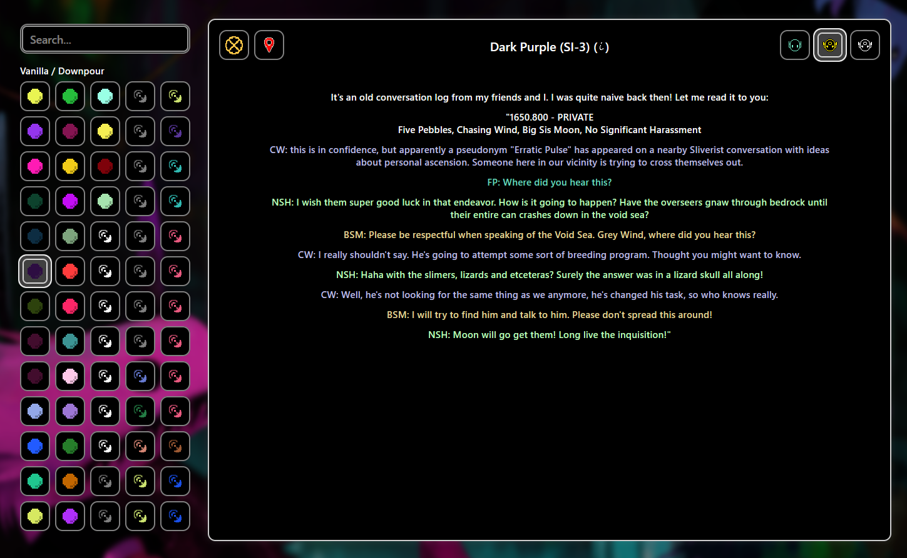

# Rain World Collection Index


[](https://yanwittmann.github.io/rw-collection-index)

The Rain World Collection Index is a React web application
created to help players explore and keep track of the lore in the game
[Rain World](https://store.steampowered.com/app/312520/Rain_World/).
It provides a centralized place to browse and read all Pearls and Broadcasts
from the vanilla version and the Downpour DLC.

🔗 Hosted at
[https://yanwittmann.github.io/rw-collection-index](https://yanwittmann.github.io/rw-collection-index)

## Data and Features

Complete listing of all:

- Pearls (Vanilla, Downpour)
- Broadcasts
- Five Pebbles Pearls
- White Pearls
- Broadcast Pearls
- Developer Commentary
- Item Descriptions
- Iterator Dialogue (LttM, FP)
- Echoes Dialogue
- The Watcher Dialogue

Further features:

- Links to the locations on the interactive Rain World map.
- Spoiler/Unlock mode where all items start hidden ("?") and can display progressive hints if needed.
- URL stores currently selected entry and transcriber to easily share contents with others.
- Search functionality that allows to perform a full-text search across all entries and filter for regions, speakers and
  more.
- Hover over speaker names to reveal full names.
- Display of the original game files when viewing a transcription.
- Keyboard navigation.

Information is sourced from the [Rain World Wiki](https://rainworld.miraheze.org/wiki/Pearl/Dialogue) and the game
itself.



## Unlock Modes

- View All: Instantly access all content
- Spoiler/Unlock Mode: Gradual discovery system
    - Items start as locked
    - Progressive hints guide exploration
    - Items can be manually unlocked when found in-game
    - Option to reset unlocks

## Technical Details

- Built with React and TypeScript
- Custom UI components styled for Rain World
- URL parameter support (disabled in unlock mode to prevent spoilers)
    - `item=<id>`: Selects a specific pearl (e.g., `item=SI_chat3`)
    - `transcriber=<id>`: Selects a transcriber for the chosen pearl (e.g., `transcriber=LttM-pre-collapse`)
- Hover over speaker names to reveal full names
- Hold shift to show the amount of transcriptions on each entry

## Installation and Setup

### Clone the Repository / Install Dependencies

```bash
git clone https://github.com/YanWittmann/rw-collection-index
cd rw-collection-index/site
npm install
```

### Run the Application

```bash
npm run start
```

### Build the Application

```bash
npm run build
```

### Preparation: Rain World strings (old)

> :warn: This method does not work on the broadcasts and is therefore deprecated.

We need to extract the strings from Rain World to use them in the application.
Copy the following python program [decrypt-rw-text.py](site/build-scripts/decrypt-rw-text.py) into your
`SteamLibrary\steamapps\common\Rain World` folder and run it.
This will create a folder `decrypted` with all the source files in them and a `decrypted.json` file with all the
english variants of the strings.

Copy the `decrypted.json` file into the [source](dialogue/source) folder.

### Preparation: Rain World strings (new)

Run https://steamcommunity.com/sharedfiles/filedetails/?id=2933241596 on your game as a mod to extract the strings.
They will be written into the `Rain World/RainWorld_Data/StreamingAssets/decrypt` directory.
Rename the directories to `text_[Lang]` instead of `[lang]` (e.g. `text_eng` instead of `Eng`).

Certain decompiled source files have been extracted from the `Rain World/RainWorld_Data/Managed/Assembly-CSharp.dll`
file using [dnSpy](https://github.com/dnSpy/dnSpy) and moved to the
[dialogue/source/dll](dialogue/source/dll) directory.
Copy this directory into the `decrypt`, next to the other files.

Then run [decrypt-rw-text.py](site/build-scripts/decrypt-rw-text.py) inside your
`SteamLibrary\steamapps\common\Rain World\RainWorld_Data\StreamingAssets\decrypt` folder to create the `decrypted.json`
and move it to the [source](dialogue/source) folder.

There is also a custom script available for decoding entire directories of files, with special case handling in case the
file was renamed and the salt for the hash differs from the expected
one: [decrypt-entry.py](site/build-scripts/decrypt-entry.py).
I sometimes fails though, and I'm not sure why. The success rate is roughly 98%, so for the rest we have to fallback on
the decryption mod.

## Contributing

Contributions are welcome! Please open an Issue or Pull Request to discuss changes.

Thanks to:

| User                      | Suggestions and Contributions                                                                           |
|---------------------------|---------------------------------------------------------------------------------------------------------|
| Space Dwarf               | "Colored Pearls + Broadcasts" category rename.                                                          |
| Space Dwarf               | DLC Tag for DLC content.                                                                                |
| bug leaving room          | Use up-to-date interactive map links.                                                                   |
| bug leaving room          | Info that certain text color only exists in DP.                                                         |
| Hmoorkin                  | Broadcast icons are too similar in color.                                                               |
| yukithedestroyer          | If there are multiple identical transcribers on an entry, they do not unlock correctly in spoiler mode. |
| Space Dwarf               | Some incorrect map locations.                                                                           |
| candlesign.4539 / skyball | Keyboard navigation.                                                                                    |
| bug leaving room          | Show Pearl's internal identifiers.                                                                      |
| scir                      | Created new Icon set.                                                                                   |
| ShockMicro                | Some DP items were not marked as such.                                                                  |
| candlesign.4539           | Buttons get stuck in the hovered state; replaced framer-motion native logic with custom hover logic.    |
| capwolfbane / SUNFISH     | Incorrectly "vanilla" tagged elements.                                                                  |
| capwolfbane               | Merge "FP" and "Five Pebbles" filter entries.                                                           |
| erickckk                  | Correct TEXT_KITESDAY map location link.                                                                |

Feel like you should be on this list? Let me know!

### Privacy Notice

See [Privacy Notice](./privacy.md).
