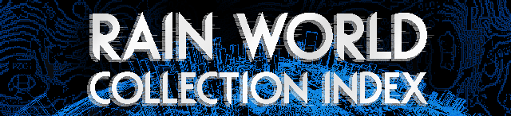
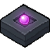

# Rain World Collection Index



The Rain World Collection Index is a comprehensive interactive archive created to help players explore and keep track of [Rain World's](https://store.steampowered.com/app/312520/Rain_World/) lore.
It provides a centralized place to browse all Pearls, Broadcasts, Dialogue and Projections from the Vanilla base game, Downpour DLC, The Watcher DLC and popular community mods.

🔗 **Hosted at:** [https://yanwittmann.github.io/rw-collection-index](https://yanwittmann.github.io/rw-collection-index)

## Collection Index Content

The dataset spans the entire known history of the Ancients and Iterators.

<table>
  <thead>
    <tr>
      <th width="25%">Expansion / Source</th>
      <th width="75%">Content Details</th>
    </tr>
  </thead>
  <tbody>
    <!-- VANILLA -->
    <tr>
      <td align="center">
        <br/>
        <b>Base Game</b>
      </td>
      <td>
        <ul>
          <li> All transcriptions for Colored, White, and Five Pebbles pearls.</li>
          <li> Dialogue trees for Looks to the Moon and Five Pebbles.</li>
          <li> Dialogue for all Echoes.</li>
          <li> All item descriptions.</li>
        </ul>
        <p>
          
          
          
         &nbsp;'&nbsp;&nbsp;
          
        </p>
      </td>
    </tr>
    <!-- DOWNPOUR -->
    <tr>
      <td align="center">
        <br/>
        <b>Downpour</b>
      </td>
      <td>
        <ul>
          <li> All transcriptions for Colored, White, and Five Pebbles pearls.</li>
          <li> All intercepted logs and transmissions from  Spearmaster's campaign.</li>
          <li> Campaign-specific iterator interactions.</li>
          <li> Full developer commentary.</li>
        </ul>
        <p>
          
          
          
          
          
          
         &nbsp;'&nbsp;&nbsp;
          
          
        </p>
      </td>
    </tr>
    <!-- WATCHER -->
    <tr>
      <td align="center">
        <br/>
        <b>The Watcher</b>
      </td>
      <td>
        <ul>
          <li> Animated Pearl Reader Projections.</li>
          <li> Pearl Reader Audio Files.</li>
          <li> Pearl Reader Readings.</li>
          <li> Spinning Top dialogue.</li>
          <li> Rot Prince dialogue.</li>
          <li> Void Weaver dialogue.</li>
        </ul>
        <p>
          
        </p>
      </td>
    </tr>
    <!-- MODDED -->
    <tr>
      <td align="center">
        <br/>
        <b>Community Mods</b>
      </td>
      <td>
        <ul>
          <li> Lore and pearls found in popular region mods.</li>
          <li> Custom Iterator dialogue from community projects.</li>
        </ul>
        <p>
          
         &nbsp;'&nbsp;&nbsp;
          
          
        </p>
        <p>
          Looking for a missing mod? Let me know, or <a href="#contributing">contribute</a> it yourself!
        </p>
      </td>
    </tr>
  </tbody>
</table>

## Features

<table>
  <tr>
    <td width="50%" valign="top" style="padding: 10px;">
      <strong> Spoiler Protection</strong>
      <p>Designed for first-time players. Toggle Unlock Mode to hide all text behind "?". Reveal hints progressively or verify your in-game findings manually without spoiling the rest of the collection.</p>
    </td>
    <td width="50%" valign="top" style="padding: 10px;">
      <strong> Search and Filter</strong>
      <p>Full-text search across the entire database. Filter results by Region, Speaker, Type or Tag. Hover over speaker names (e.g. LttM, NSH) to reveal their full canonical names and text color.</p>
    </td>
  </tr>
  <tr>
    <td valign="top" style="padding: 10px;">
      <strong> Interactive Map Links</strong>
      <p>Most entries are linked directly to the <a href="https://rain-world-map.github.io/">Rain World Interactive Map</a> or related maps. Click the pin icon to see exactly where a Pearl or Broadcast is located in the game world.</p>
    </td>
    <td valign="top" style="padding: 10px;">
      <strong> Deep Linking</strong>
      <p>Share specific lore entries easily. The URL updates as you browse, storing the selected item and the specific transcriber.</p>
      <code>?item=SI_chat3</code> &nbsp; <code>?transcriber=LttM-pre-collapse</code>
    </td>
  </tr>
  <tr>
    <td valign="top" style="padding: 10px;">
      <strong> Source Data View</strong>
      <p>Toggle "Source View" to see the original game file identifiers, internal IDs, and raw text strings and source code on selected entries alongside the formatted transcription.</p>
    </td>
    <td valign="top" style="padding: 10px;">
      <strong> All Transcriptions</strong>
      <p>Switch between different Iterator readings and interpretations for the same pearl (e.g. Moon Pre-Collapse vs. Post-Collapse).</p>
    </td>
  </tr>
</table>


## Installation and Setup

### Clone the Repository / Install Dependencies

```bash
git clone https://github.com/YanWittmann/rw-collection-index
cd rw-collection-index/site
npm install
```

### Run the Application

```bash
npm run start
```

### Build the Application

```bash
npm run build
```

## Data Preparation

If you feel like replicating the dataset yourself, well, here you go.

### Game Text extraction

To populate the application with the latest text, you need to extract the strings from the game files.

#### Method 1: Mod Extraction

1. Install and run the [Text Extractor Mod](https://steamcommunity.com/sharedfiles/filedetails/?id=2933241596) from the Steam Workshop. The mod will write the extracted files into the following directory:
   `Rain World/RainWorld_Data/StreamingAssets/decrypt`
2. In the `decrypt` directory, rename the language folders from `[lang]` to `text_[lang]` (e.g. `Eng` becomes `text_eng`).
3. Certain hard-coded strings have been extracted from `Rain World/RainWorld_Data/Managed/Assembly-CSharp.dll` using [dnSpy](https://github.com/dnSpy/dnSpy). These files are already included in this repository at `[dialogue/source/dll](dialogue/source/dll)`. Copy this `dll` directory into your `decrypt` folder alongside the `text_...` folders.
4. Run the main decryption script inside your `.../StreamingAssets/decrypt` folder: `python path/to/repo/site/build-scripts/decrypt-rw-text.py`.  
   This will process all text files and the `dll` sources into a single JSON file.
5. Move the resulting `decrypted.json` file to the [dialogue/source](dialogue/source) directory in this repository.

<details>
<summary><b>Method 2: Old Python Script (Deprecated)</b></summary>

> :warning: This method does not work on broadcasts and is therefore deprecated.

We need to extract the strings from Rain World to use them in the application.
Copy the following python program [decrypt-rw-text.py](site/build-scripts/decrypt-rw-text.py) into your
`SteamLibrary\steamapps\common\Rain World` folder and run it.
This will create a folder `decrypted` with all the source files in them and a `decrypted.json` file with all the
english variants of the strings.

Copy the `decrypted.json` file into the [source](dialogue/source) folder.

</details>

Note:
There is also a custom script available for decoding entire directories of files, with special case handling in case the file was renamed and the salt for the hash differs from the expected one: [decrypt-entry.py](site/build-scripts/decrypt-entry.py).
It sometimes fails, however; its success rate is roughly 98%, so for the rest we have to fallback on the decryption mod.

## Contributing

Contributions are welcome! Please open an Issue or Pull Request to discuss changes.  
View [how-to-dialogue.md](doc/how-to-dialogue.md) to learn how to contribute your own dialogue or modify existing ones.

Do you want your modded dialogue to be added to the [modded version of the collection](https://yanwittmann.github.io/rw-collection-index/?d=modded)?
Please let me know, or follow the guide above to add it by yourself!

| User                      | Contributions                                                                                                            |
|---------------------------|--------------------------------------------------------------------------------------------------------------------------|
| Space Dwarf               | "Colored Pearls + Broadcasts" category rename; DLC Tag for DLC content; Some incorrect map locations.                    |
| bug leaving room          | Use up-to-date interactive map links; Info that certain text color only exists in DP; Show Pearl's internal identifiers. |
| Hmoorkin                  | Broadcast icons are too similar in color.                                                                                |
| yukithedestroyer          | If there are multiple identical transcribers on an entry, they do not unlock correctly in spoiler mode.                  |
| candlesign.4539 / skyball | Keyboard navigation.                                                                                                     |
| scir                      | Created new Icon set.                                                                                                    |
| ShockMicro                | Some DP items were not marked as such.                                                                                   |
| candlesign.4539           | Buttons get stuck in the hovered state; replaced framer-motion native logic with custom hover logic.                     |
| capwolfbane / SUNFISH     | Incorrectly "vanilla" tagged elements.                                                                                   |
| capwolfbane               | Merge "FP" and "Five Pebbles" filter entries.                                                                            |
| erickckk                  | Correct TEXT_KITESDAY map location link.                                                                                 |
| artustan                  | #6 remove `BroadcastMisc` entry from `Spearmasterpearl`.                                                                 |

Feel like you should be on this list? Let me know!

---

Code on <a href="https://github.com/YanWittmann/rw-collection-index" target="_blank">GitHub</a>&nbsp;&nbsp;○&nbsp;&nbsp;Created by Yan Wittmann&nbsp;&nbsp;○&nbsp;&nbsp;Rain World is property of <a href="https://videocultmedia.com" target="_blank">Videocult</a>&nbsp;&nbsp;○&nbsp;&nbsp;<a href="https://github.com/YanWittmann/rw-collection-index/blob/main/privacy.md" target="_blank">Privacy Policy</a></div>
